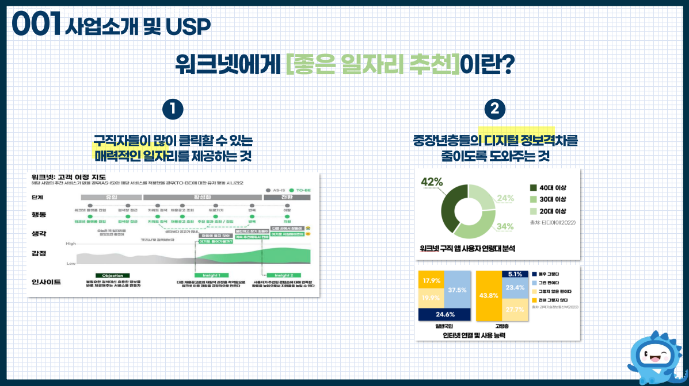
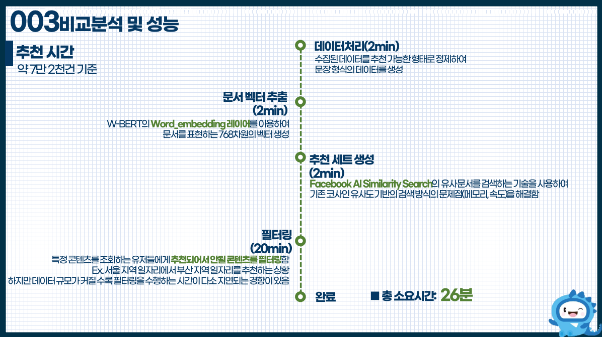

# jobjule
워크넷 플랫폼에서의 채용공고 문서 학습 및 추천 시스템 프로젝트입니다. 

## Overview
워크넷에서 제공하는 채용공고 API를 활용하여 BERT 기반의 언어모델을 
워크넷만의 취업시장에 특화된 언어모델 W-BERT를 구축하기 위해 학습합니다.
또한, 일 단위로 갱신되는 채용공고에 대한 추천 세트를 생성합니다. 

## How to Use?
> Train in app>wbert 
> ``` !python main.py --template train ```

> Recommend in app>wbert
> ``` !python main.py --template recommend ```

> Web Server Test in app
> ``` !uvicorn app:app --reload ```

## Caution
- data>raw_data>당일 날짜 폴더에 채용목록.csv 와 채용상세.csv 파일이 존재해야합니다
- 만약 API_KEY가 없을 시 샘플 데이터를 사용해보세요

## Contents
- 프로젝트의 결과물을 볼 수 있습니다

  
  
  
  
  
  


## Tistory
- [프로젝트 리뷰 : ch.1 발단과 발상](https://zzz0101.tistory.com/54)
- [프로젝트 리뷰 : ch.2 MVP정의와 아이디어](https://zzz0101.tistory.com/56)
- [프로젝트 리뷰 : ch.3 제품 개발 기획](https://zzz0101.tistory.com/56)
- ... 연재 중 
